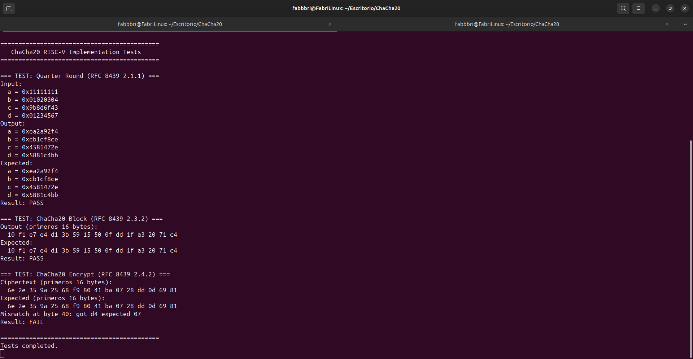
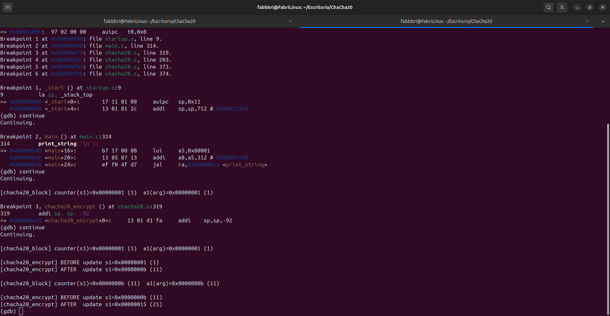
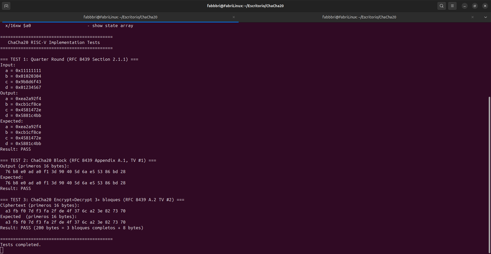
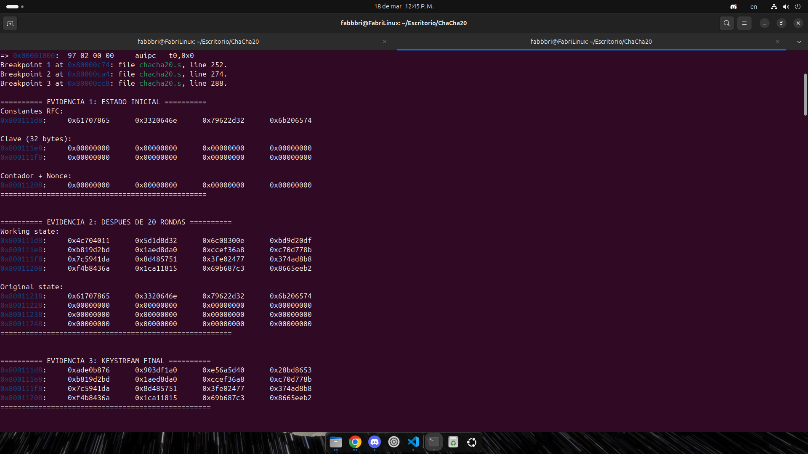
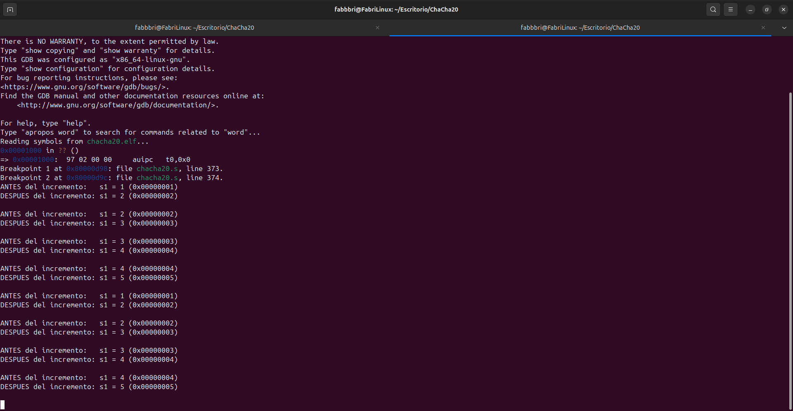

# Documentación Técnica

## Índice

1. [Arquitectura del Software](#1-arquitectura-del-software)
2. [Mapeo de Registros RISC-V](#2-mapeo-de-registros-risc-v)
3. [Evidencias de Ejecución](#3-evidencias-de-ejecución)
4. [Bitácora de Bug](#4-bitácora-de-bug)
5. [Análisis de Resultados](#5-análisis-de-resultados)

---

## 1. Arquitectura del Software

### 1.1 Separación entre Capas C y Ensamblador

El proyecto implementa una arquitectura de **dos capas** con una frontera semántica claramente definida:

**Capa C (`main.c`):** Responsable de orquestación, verificación y comunicación.
- Implementa tests del RFC 8439 (Quarter Round RQ 2.1.1, Block A.1, Encrypt A.2)
- Proporciona E/S a través de UART (funciones `print_char()`, `print_string()`, `print_hex_*()`)
- Mantiene vectores de prueba estáticos (constantes definidas en el RFC)
- Coordina llamadas a las funciones ensamblador y verifica resultados

**Capa Ensamblador (`chacha20.s`):** Responsable de toda la lógica criptográfica.
- Implementa las tres funciones exportadas: `chacha20_quarter_round`, `chacha20_inner_block` (interna), `chacha20_block`, `chacha20_encrypt`
- Acceso directo a registros y memoria para máximo rendimiento
- Control a nivel de instrucción: rotaciones, desplazamientos bit a bit, actualizaciones atómicas del estado
- Gestión manual del stack para minimizar overhead de stack frames

```
┌──────────────────────────────────────────────────────────────────┐
│                      CAPA C  (main.c)                            │
│                                                                  │
│  ┌──────────────────┐  ┌────────────────┐  ┌──────────────────┐  │
│  │  Tests RFC 8439  │  │ I/O UART       │  │ Vectores de      │  │
│  │  · QR 2.1.1      │  │ print_char()   │  │ prueba (A.1/A.2) │  │
│  │  · Block A.1     │  │ print_string() │  │ arrays estáticos │  │
│  │  · Encrypt A.2   │  │ print_hex_*()  │  │ const uint8_t[]  │  │
│  └──────────────────┘  └────────────────┘  └──────────────────┘  │
│                                                                  │
│       Responsabilidad: orquestación, verificación, I/O           │
└──────────────────────────────────┬───────────────────────────────┘
                                   │  ABI RISC-V ILP32
                                   │  (argumentos en a0–a5,
                                   │   resultado en a0)
                                   ▼
┌──────────────────────────────────────────────────────────────────┐
│                 CAPA ENSAMBLADOR  (chacha20.s)                    │
│                                                                  │
│  ┌──────────────────────────────────────────────────────────┐    │
│  │  chacha20_quarter_round  (.globl, llamable desde C)      │    │
│  │  · Recibe: state_ptr (a0), 4 índices (a1–a4)             │    │
│  │  · Opera sobre 4 palabras de estado en registros t2–t5   │    │
│  │  · Sin prologue/epilogue propio (sin llamadas internas)   │    │
│  └──────────────────────────────────────────────────────────┘    │
│  ┌──────────────────────────────────────────────────────────┐    │
│  │  chacha20_inner_block  (helper interno, .globl)          │    │
│  │  · Ejecuta las 8 QRs de un double-round (columnas +      │    │
│  │    diagonales) llamando a chacha20_quarter_round         │    │
│  │  · Preserva state_ptr en s0 entre cada una de las 8      │    │
│  │    llamadas (a0 se destruye en cada call)                │    │
│  └──────────────────────────────────────────────────────────┘    │
│  ┌──────────────────────────────────────────────────────────┐    │
│  │  chacha20_block  (.globl, llamable desde C)              │    │
│  │  · Recibe: key (a0), counter (a1), nonce (a2), out (a3)  │    │
│  │  · Construye estado inicial en stack (sp+0..63)          │    │
│  │  · Copia a estado original (sp+64..127) para suma final  │    │
│  │  · Llama chacha20_inner_block 10 veces (s4 = contador)   │    │
│  │  · Suma estado original al working_state y serializa     │    │
│  └──────────────────────────────────────────────────────────┘    │
│  ┌──────────────────────────────────────────────────────────┐    │
│  │  chacha20_encrypt  (.globl, llamable desde C)            │    │
│  │  · Recibe: key (a0), counter (a1), nonce (a2),           │    │
│  │            plaintext (a3), ciphertext (a4), len (a5)     │    │
│  │  · Loop: genera bloque de 64 bytes en stack local,       │    │
│  │    hace XOR byte a byte con el mensaje                   │    │
│  │  · Incrementa contador (s1) en 1 por bloque              │    │
│  └──────────────────────────────────────────────────────────┘    │
│                                                                  │
│       Responsabilidad: toda la criptografía y velocidad          │
└──────────────────────────────────┬───────────────────────────────┘
                                   │
                                   ▼
┌──────────────────────────────────────────────────────────────────┐
│              INFRAESTRUCTURA  (startup.s + linker.ld)            │
│  · startup.s: inicializa sp a top-of-RAM, invoca main()          │
│  · linker.ld: sitúa .text en 0x80000000 (RAM de QEMU virt),      │
│               define heap/stack y símbolo _start                 │
└──────────────────────────────────────────────────────────────────┘
```

**¿Por qué esta separación?** Los requisitos criptográficos (una parte del software) exigen control directo sobre bits y registros para evitar vulnerabilidades de timing y optimizar velocidad. El ensamblador es necesario. El código de verificación y E/S no tiene esos requisitos críticos y es mejor en C: más legible, más mantenible, no afecta el rendimiento general.

### 1.2 Interfaces Definidas

Las funciones exportadas desde `chacha20.s` constituyen la única superficie de contacto entre ambas capas. Su contrato ABI (Application Binary Interface) RISC-V ILP32 es el siguiente:

#### `chacha20_quarter_round` — primitiva criptográfica

```c
extern void chacha20_quarter_round(uint32_t *state, int a, int b, int c, int d);
```

| Parámetro | Registro | Contenido |
|-----------|----------|-----------|
| `state`   | `a0`     | Puntero al array de estado (16 × 4 bytes = 64 bytes) |
| `a`       | `a1`     | Índice (0–15) de la palabra que actúa como `a` en el QR |
| `b`       | `a2`     | Índice de la palabra `b` |
| `c`       | `a3`     | Índice de la palabra `c` |
| `d`       | `a4`     | Índice de la palabra `d` |

**Comportamiento:** Modifica `state[a]`, `state[b]`, `state[c]` y `state[d]` en memoria según el algoritmo ChaCha20 QR. No retorna valor.

#### `chacha20_block` — generación de un bloque de keystream

```c
extern void chacha20_block(uint8_t *key, uint32_t counter, uint8_t *nonce, uint8_t *output);
```

| Parámetro | Registro | Contenido |
|-----------|----------|-----------|
| `key`     | `a0`     | Puntero a la clave de 32 bytes |
| `counter` | `a1`     | Valor del contador de bloque (32 bits) |
| `nonce`   | `a2`     | Puntero al nonce de 12 bytes |
| `output`  | `a3`     | Destino del keystream de 64 bytes generado |

**Comportamiento:** Genera un bloque de 64 bytes de keystream pseudoaleatorio usando la clave, contador y nonce. Escribe el resultado en `output` (que debe tener al menos 64 bytes).

#### `chacha20_encrypt` — cifrado/descifrado de longitud arbitraria

```c
extern void chacha20_encrypt(const uint32_t *key, uint32_t counter,
                             const uint32_t *nonce,
                             const uint8_t *plaintext, uint8_t *ciphertext,
                             uint32_t len);
```

| Parámetro    | Registro | Contenido |
|--------------|----------|-----------|
| `key`        | `a0`     | Puntero a la clave (8 palabras de 32 bits) |
| `counter`    | `a1`     | Contador inicial de bloque |
| `nonce`      | `a2`     | Puntero al nonce (3 palabras de 32 bits) |
| `plaintext`  | `a3`     | Puntero al mensaje de entrada |
| `ciphertext` | `a4`     | Puntero al buffer de salida |
| `len`        | `a5`     | Longitud en bytes del mensaje |

**Comportamiento:** Cifra (o descifra, ChaCha20 es simétrico) un mensaje de longitud arbitraria. Internamente, genera bloques de keystream y hace XOR byte a byte.

### 1.3 Justificación de Decisiones de Diseño

| Decisión | Justificación | Impacto |
|----------|---------------|--------|
| **`chacha20_quarter_round` como función separada** | Permite reutilización sin duplicar código para las 4 rondas de columna y las 4 rondas diagonal de cada double-round (80 invocaciones/bloque). | Corrección crítica: el QR es la operación atómica más pequeña; aislarla facilita verificación y auditoría. |
| **`chacha20_inner_block` como auxiliar interno** | Agrupa las 8 llamadas a `chacha20_quarter_round` de un double-round. El bucle de 10 iteraciones en `chacha20_block` queda reducido a simples cargas/branches. | Legibilidad: el pseudocódigo del RFC y el ensamblador muestran paralelismo claro. |
| **Rotaciones mediante `slli`/`srli` + `or`** | RV32IM no dispone de instrucción `rol`/`ror`. La secuencia de 3 instrucciones es la forma estándar en este ISA. | Portabilidad: funciona en cualquier RV32IM sin extensiones. |
| **Estado de 64 bytes en el stack, no en registros** | RV32IM tiene 32 registros; el estado ocupa 16 de ellos solo en datos. Almacenarlo en stack (acceso `lw`/`sw`) permite mantener dos copias (working + original) para suma final. | Simplicidad: evita reasignaciones de registros y reutilización compleja. |
| **Registros `s0`–`s5` (callee-saved) para parámetros vivos** | Las llamadas a funciones destruyen `a0`–`a5` y `t0`–`t6`. Los valores que deben sobrevivir (key, nonce, contador de iteraciones) se trasladan a `s`-registers. | Garantía ABI: el caller confía que los `s`-registers se preserven; el callee también. |
| **Registros `t2`–`t5` en `chacha20_quarter_round`** | Esta función no llama a nadie, así que no hay riesgo de que `call` destruya sus valores. El uso de `t`-registers evita prologue/epilogue innecesarios. | Rendimiento: se ejecuta 80 veces/bloque; ahorrar 2-3 instrucciones por ejecución suma. |
| **Tests y vectores RFC en C** | El código de verificación, E/S UART y arrays de constantes son más legibles en C; además, no son rutas críticas de rendimiento. | Mantenimiento: cambios futuros en tests son triviales; en ensamblador serían propensos a errores. |

---

## 2. Mapeo de Registros RISC-V

### 2.1 Organización del Estado ChaCha20 (16 palabras de 32 bits)

El estado es una matriz 4×4 de palabras de 32 bits, con la siguiente asignación semántica definida en el RFC 8439:

```
     Columna 0    Columna 1    Columna 2    Columna 3
    ┌───────────┬───────────┬───────────┬───────────┐
    │ state[ 0] │ state[ 1] │ state[ 2] │ state[ 3] │  ← "expa", "nd 3", "2-by", "te k"
    │ 0x61707865│ 0x3320646e│ 0x79622d32│ 0x6b206574│     (constantes ASCII fijas del RFC)
    ├───────────┼───────────┼───────────┼───────────┤
    │ state[ 4] │ state[ 5] │ state[ 6] │ state[ 7] │  ← key[0..3], key[4..7],
    │           │           │           │           │     key[8..11], key[12..15]
    ├───────────┼───────────┼───────────┼───────────┤
    │ state[ 8] │ state[ 9] │ state[10] │ state[11] │  ← key[16..19], key[20..23],
    │           │           │           │           │     key[24..27], key[28..31]
    ├───────────┼───────────┼───────────┼───────────┤
    │ state[12] │ state[13] │ state[14] │ state[15] │  ← counter, nonce[0..3],
    │           │           │           │           │     nonce[4..7], nonce[8..11]
    └───────────┴───────────┴───────────┴───────────┘
```

**Almacenamiento:** Este estado de 64 bytes **vive en el stack** durante toda la ejecución. No cabe entero en registros (RV32I tiene 32 registros de 32 bits; si 16 se usan para datos del estado, restan 16 para punteros, índices, temporales y valores ABI—es insuficiente). El acceso por `lw`/`sw` desde el stack es la solución práctica.

### 2.2 Mapeo en `chacha20_quarter_round`

El quarter round es la primitiva más pequeña: recibe **índices** (no punteros a palabras) y opera sobre las palabras seleccionadas cargándolas en registros temporales:

```
Firma de llamada: chacha20_quarter_round(state_ptr, idx_a, idx_b, idx_c, idx_d)

Argumentos:
  a0 ──► Puntero base al estado (no se modifica durante la función)
  a1 ──► idx_a (índice)  →  slli a1,a1,2  →  offset_a = idx_a × 4 (bytes)
  a2 ──► idx_b (índice)  →  slli a2,a2,2  →  offset_b = idx_b × 4
  a3 ──► idx_c (índice)  →  slli a3,a3,2  →  offset_c = idx_c × 4
  a4 ──► idx_d (índice)  →  slli a4,a4,2  →  offset_d = idx_d × 4

Carga de palabras en registros de trabajo:
  t2  ←  state[idx_a]  (palabra "a")  ← lw t2, 0(a0 + offset_a)
  t3  ←  state[idx_b]  (palabra "b")  ← lw t3, 0(a0 + offset_b)
  t4  ←  state[idx_c]  (palabra "c")  ← lw t4, 0(a0 + offset_c)
  t5  ←  state[idx_d]  (palabra "d")  ← lw t5, 0(a0 + offset_d)

Operación: máquina de estados de 4 líneas
  Línea 1: a += b; d ^= a; d <<<= 16;
  Línea 2: c += d; b ^= c; b <<<= 12;
  Línea 3: a += b; d ^= a; d <<<= 8;
  Línea 4: c += d; b ^= c; b <<<= 7;

Registros temporales de rotación:
  t0, t1  ← mitades de la rotación (descartados tras cada `or`)

Escritura de resultados:
  sw t2, 0(a0 + offset_a)   →  state[idx_a] = t2
  sw t3, 0(a0 + offset_b)   →  state[idx_b] = t3
  sw t4, 0(a0 + offset_c)   →  state[idx_c] = t4
  sw t5, 0(a0 + offset_d)   →  state[idx_d] = t5
```

**¿Por qué `t2`–`t5` y no registros callee-saved (`s`)?**
- `chacha20_quarter_round` **no llama a ninguna otra función**, así que nunca hay peligro de que un `call` destruya sus registros.
- Los registros `t` (caller-saved) no requieren salvado/restauración en prologue/epilogue.
- Ventaja de rendimiento: se ejecuta **80 veces por bloque** (10 iteraciones × 8 Quarter Rounds); ahorrar prologue/epilogue innecesarios suma decenas de ciclos.
- Los registros `s` quedarían "desperdiciados" obligando a generar código de salvar/restaurar en cada invocación.

### 2.3 Mapeo en `chacha20_inner_block`

`chacha20_inner_block` coordina las **8 llamadas** a `chacha20_quarter_round` que forman un double-round (4 columnas + 4 diagonales). Su único reto es **conservar el puntero al estado** entre esas llamadas, ya que `a0` es destruido al entrar en `chacha20_quarter_round`:

```
Stack frame (16 bytes reservados):
  sp + 0   ← s0   (salvado)
  sp + 4   ← ra   (salvado)
  sp + 8..15 ← sin usar (pero reservados para alineación)

Prologue:
  addi    sp, sp, -16     # reservar 16 bytes
  sw      s0, 0(sp)       # guardar s0 (callee-saved)
  sw      ra, 4(sp)       # guardar ra (return address)
  mv      s0, a0          # s0 = estado_ptr (preservar entre calls)

Cuerpo (8 Quarter Rounds): por cada uno:
  mv  a0, s0             # restaurar estado_ptr antes del call
  li  a1, idx_a          # cargar índices...
  li  a2, idx_b
  li  a3, idx_c
  li  a4, idx_d
  call chacha20_quarter_round

Epilogue:
  lw      s0, 0(sp)      # restaurar s0
  lw      ra, 4(sp)      # restaurar ra
  addi    sp, sp, 16     # deshacer reserva (balancear prologue)
  ret
```

**¿Por qué `s0` en `inner_block`?**
- `s0` es callee-saved: su valor se preserva automáticamente según ABI (el caller confía en esto).
- Los parámetros (`a0..a4`) son destruidos por cada `call`, así que necesitamos un almacenamiento seguro para el puntero.
- `t`-registers no funcionan: `chacha20_quarter_round` podría modificarlos (aunque aquí no lo hace, confiar en ello violaría encapsulación).

### 2.4 Mapeo en `chacha20_block`

`chacha20_block` es la función más compleja: construye el estado inicial, ejecuta 10 double-rounds y serializa el keystream. Necesita mantener vivos **5 valores** a través de múltiples `call`s:

```
Stack frame (176 bytes):
┌──────────────────────────────────────────────────────────┐
│  Offset (bytes desde sp)                                 │
├──────────────────────────────────────────────────────────┤
│  0–63    │  working_state[0..15]  (4 bytes × 16)        │
│  64–127  │  original_state[0..15] (copia para suma)    │
│  128–151 │  sin usar (espacio de holgura)               │
│  152     │  s4  (guardado, contador iteraciones)        │
│  156     │  s3  (guardado, output ptr)                  │
│  160     │  s2  (guardado, nonce ptr)                   │
│  164     │  s1  (guardado, counter value)               │
│  168     │  s0  (guardado, key ptr)                     │
│  172     │  ra  (return address)                        │
└──────────────────────────────────────────────────────────┘
```

Asignación de registros callee-saved durante la vida de la función:

| Registro | Valor almacenado | Palabras del estado | Por qué callee-saved |
|----------|------------------|-------------------|----------------------|
| `s0` | Puntero a `key` (32 bytes) | state[4..11] | Necesario en PASO 1 para construir; `call inner_block` lo destruiría. |
| `s1` | `counter` (valor de 32 bits) | state[12] | Valor original que se escribe en sp+48; se incrementa en `chacha20_encrypt`. |
| `s2` | Puntero a `nonce` (12 bytes) | state[13..15] | Necesario en PASO 1; `call inner_block` lo destruiría. |
| `s3` | Puntero al `output` (buffer destino) | (no es parte del estado) | Usado solo en PASO 5 (serialización); debe preservarse. |
| `s4` | Contador de iteraciones (10 → 0) | (no es parte del estado) | Decrementado en loop `.Linner_block_loop`; perdería su valor con `call` si fuera `t`-register. |

**PASO 1 — Construcción del estado en sp+0..sp+63:**

```
Estado = [Constantes] | [Clave] | [Contador] | [Nonce]

sp +  0..12  ← 0x61707865, 0x3320646e, 0x79622d32, 0x6b206574  (constantes RFC)
sp + 16..44  ← key[0..7]  cargada desde (s0)
sp + 48      ← counter value (s1) escribido como state[12]
sp + 52..60  ← nonce[0..2] cargada desde (s2)
```

Cada palabra se trae desde memoria con `lw` (la clave y el nonce desde sus punteros) o se carga literal (`li` para constantes), y se escriben al stack con `sw`.

**PASO 2 — Preservar estado inicial (sp+64..127):**

Bucle que copia sp+0..63 → sp+64..127. Esta copia se necesita porque PASO 3 modifica sp+0..63; PASO 4 requiere la versión sin modificar.

**PASO 3 — Loop de 10 double-rounds:**

```
li      s4, 10              # iteraciones
.Linner_block_loop:
  mv    a0, sp              # paso estado (working_state) como argumento
  call  chacha20_inner_block
  addi  s4, s4, -1
  bnez  s4, .Linner_block_loop
```

Cada llamada ejecuta una secuencia de 8 Quarter Rounds (4 columnas + 4 diagonales).

**PASO 4 — Suma de estados:**

```
working_state[i] += original_state[i]   (para i = 0..15)
```

Este paso es mandatorio en el RFC: el estado se modifica por los QRs, pero el resultado final se obtiene sumando la copia inmutable. Esto es parte de la construcción de keystream.

**PASO 5 — Serialización:**

```
output[0..63] = working_state[0..15]    (escrito como 64 bytes, little-endian)
```

El resultado se serializa al buffer `output` (pasado como s3). Cada palabra de 32 bits se escribe con `sw`.

### 2.5 Mapeo en `chacha20_encrypt`

`chacha20_encrypt` mantiene el contexto de cifrado en un **loop sobre bloques** de 64 bytes. Necesita 6 valores vivos a través de cada `call chacha20_block`:

```
Stack frame (96 bytes):
  sp + 0..63   ← temporales: bloque de keystream generado (64 bytes)
  sp + 64      ← s5 (salvado, bytes restantes)
  sp + 68      ← s4 (salvado, puntero ciphertext)
  sp + 72      ← s3 (salvado, puntero plaintext)
  sp + 76      ← s2 (salvado, puntero nonce)
  sp + 80      ← s1 (salvado, contador actual)
  sp + 84      ← s0 (salvado, puntero key)
  sp + 88      ← ra (return address)
```

| Registro | Valor | Parámetro ABI | Por qué |
|----------|-------|---------------|--------|
| `s0` | Puntero a `key` (no cambia) | `a0` (salida) | Reutilizado en cada `call chacha20_block`. |
| `s1` | **Contador actual** (se incrementa) | `a1` (entrada) | Parámetro de cada `call`; se recarga en `a1` antes de llamar. |
| `s2` | Puntero a `nonce` (no cambia) | `a2` (salida) | Reutilizado en cada `call chacha20_block`. |
| `s3` | Puntero en **plaintext** (avanza +bytes_procesados) | `a3` (entrada) | Se actualiza al final de cada iteración: `add s3, s3, t0`. |
| `s4` | Puntero en **ciphertext** (avanza +bytes_procesados) | `a4` (salida) | Se actualiza al final de cada iteración: `add s4, s4, t0`. |
| `s5` | Bytes **restantes** por cifrar (decrece) | `a5` (entrada) | Se actualiza al final de cada iteración: `sub s5, s5, t0`. |

**Loop principal:**

```
.Lprocess_next_chunk:
  beqz  s5, .Lfinish_encrypt        # salir si no quedan bytes

  call  chacha20_block              # genera 64 bytes de keystream en sp+0..63

  # XOR byte a byte del plaintext con el keystream
  li    t0, 0                       # índice dentro del bloque
  .Lbyte_mix_loop:
    bgeu t0, s5, .Lend_byte_mix    # salir si bytes restantes <= índice
    bgeu t0, 64, .Lend_byte_mix    # salir si ya se procesaron 64 bytes

    lbu  t3, 0(s3 + t0)            # cargar byte del plaintext
    lbu  t4, 0(sp + t0)            # cargar byte del keystream
    xor  t3, t3, t4                # cifrado = plaintext XOR keystream
    sb   t3, 0(s4 + t0)            # escribir byte cifrado
    addi t0, t0, 1
    j    .Lbyte_mix_loop

  .Lend_byte_mix:
    add  s3, s3, t0                # avanzar entrada
    add  s4, s4, t0                # avanzar salida
    sub  s5, s5, t0                # descontar bytes cifrados
    addi s1, s1, 1                 # siguiente bloque: incrementar contador
    j    .Lprocess_next_chunk
```

**Ventaja:** El almacenamiento de 64 bytes de keystream en el stack de `chacha20_encrypt` es **temporal**; se sobrescribe en cada iteración. No requiere preservación entre bloques.

### 2.6 Operación de Rotación (sin instrucción nativa)

RISC-V RV32IM no tiene instrucción de rotación (`rol`, `ror`). Se implementa con desplazamientos combinados:

```asm
# Rotación izquierda de x en n bits: x <<<= n
# Resultado: (x << n) | (x >> (32 - n))

slli    t0, x, n         # t0 = x << n
srli    t1, x, (32 - n)  # t1 = x >> (32 - n)
or      x, t0, t1        # x = t0 | t1
```

**Instancias en `chacha20_quarter_round`:**

```asm
# d <<<= 16
slli    t0, t5, 16
srli    t1, t5, 16
or      t5, t0, t1

# b <<<= 12
slli    t0, t3, 12
srli    t1, t3, 20       # 32 - 12 = 20
or      t3, t0, t1

# d <<<= 8
slli    t0, t5, 8
srli    t1, t5, 24       # 32 - 8 = 24
or      t5, t0, t1

# b <<<= 7
slli    t0, t3, 7
srli    t1, t3, 25       # 32 - 7 = 25
or      t3, t0, t1
```

Los registros `t0` y `t1` se reutilizan en cada rotación (sus valores son descartables tras el `or`).

---

## 3. Evidencias de Ejecución


---

## 4. Bitácora de Bug: Incremento Incorrecto del Contador en `chacha20_encrypt`

### Descripción del error

Durante el desarrollo de `chacha20_encrypt`, se introdujo un error en la lógica de actualización del contador de bloque. Al finalizar el procesamiento de cada chunk de 64 bytes, el contador debía incrementarse en **1**, pero por error se escribió el valor `10` en lugar de `1`:
```riscv
# Código incorrecto
addi s1, s1, 10        # ← debía ser 1, no 10

# Código correcto
addi s1, s1, 1
``` 

El efecto fue que, a partir del segundo bloque, el contador tomaba valores completamente erróneos (1 → 11 → 21 → ...), lo que producía un keystream incorrecto y hacía fallar la prueba `ChaCha20 Encrypt (RFC 8439 2.4.2)` desde el byte 40 en adelante, como se observa en la siguiente captura:





Los primeros 40 bytes coincidían porque pertenecen al **primer bloque**, cuyo contador inicial es correcto. El error solo se manifestaba a partir del segundo bloque.

---

### Detección

El error fue identificado inicialmente mediante **revisión directa del código fuente**: al releer la lógica de avance de punteros y actualización del contador, la constante `10` resultó obviamente incorrecta en ese contexto.

Sin embargo, para confirmar el comportamiento en ejecución y familiarizarse con el uso de GDB sobre RISC-V/QEMU, se instrumentó una sesión de depuración con breakpoints condicionales que imprimían el valor del registro `s1` (contador) antes y después de cada actualización, así como al entrar a `chacha20_block`:
```gdb
break chacha20.s:203
commands
    silent
    printf "\n[chacha20_block] counter(s1)=0x%08x (%u)  a1(arg)=0x%08x (%u)\n", $s1, $s1, $a1, $a1
    continue
end

break chacha20.s:373
commands
    silent
    printf "\n[chacha20_encrypt] BEFORE update s1=0x%08x (%u)\n", $s1, $s1
    continue
end

break chacha20.s:374
commands
    silent
    printf "[chacha20_encrypt] AFTER  update s1=0x%08x (%u)\n", $s1, $s1
    continue
end
` ``

La salida de GDB confirmó el comportamiento incorrecto: el contador saltaba de `1` a `11` en la primera actualización, y de `11` a `21` en la segunda, en lugar de incrementarse de uno en uno:
```



---

### Corrección

Se reemplazó el valor incorrecto:
```riscv
# Antes (incorrecto)
addi s1, s1, 10

# Después (correcto)
addi s1, s1, 1
```
Tras la corrección, la prueba de cifrado pasó satisfactoriamente, y los tres tests del RFC (Quarter Round, Block y Encrypt) produjeron `Result: PASS`.


## 5. Análisis de Resultados









---

